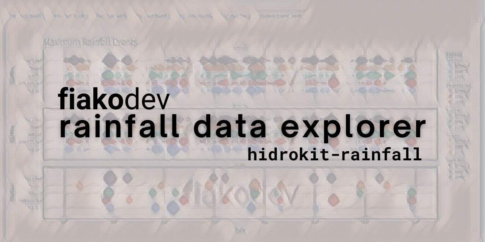
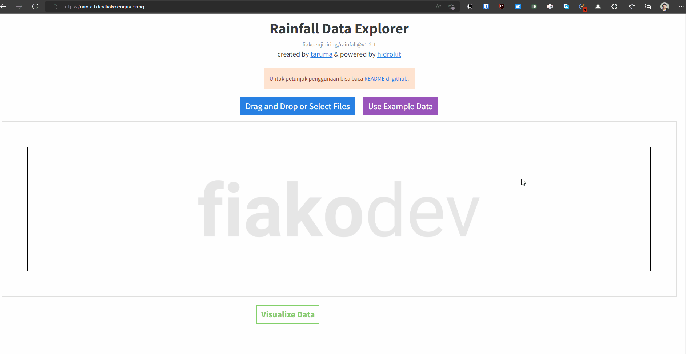
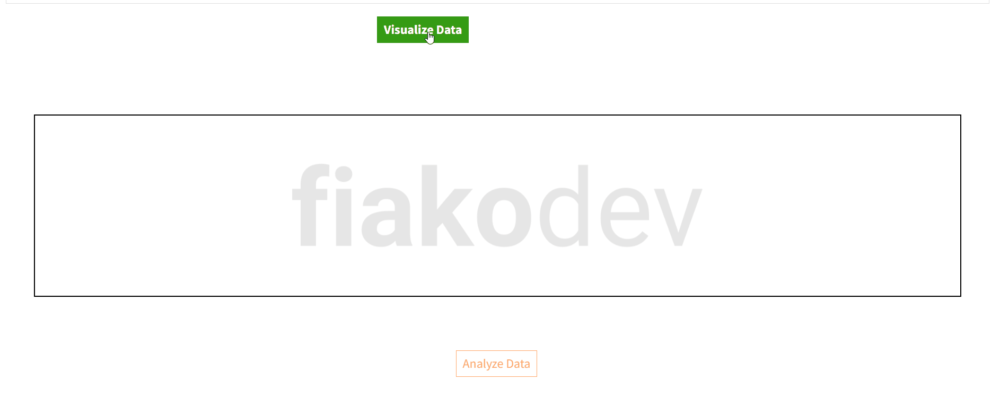
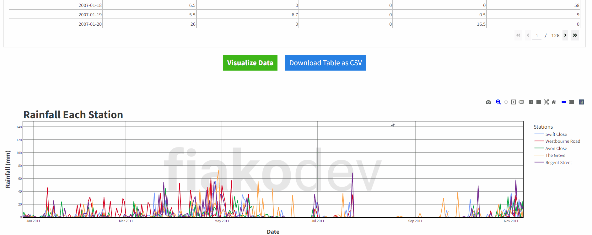
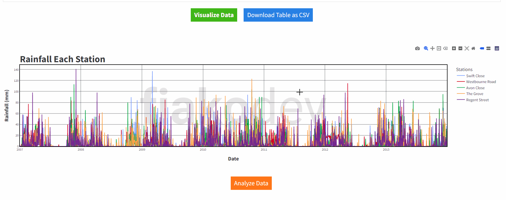
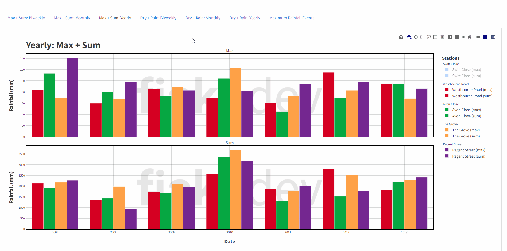
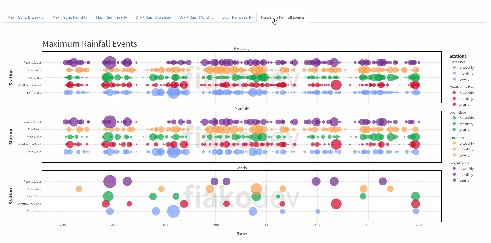
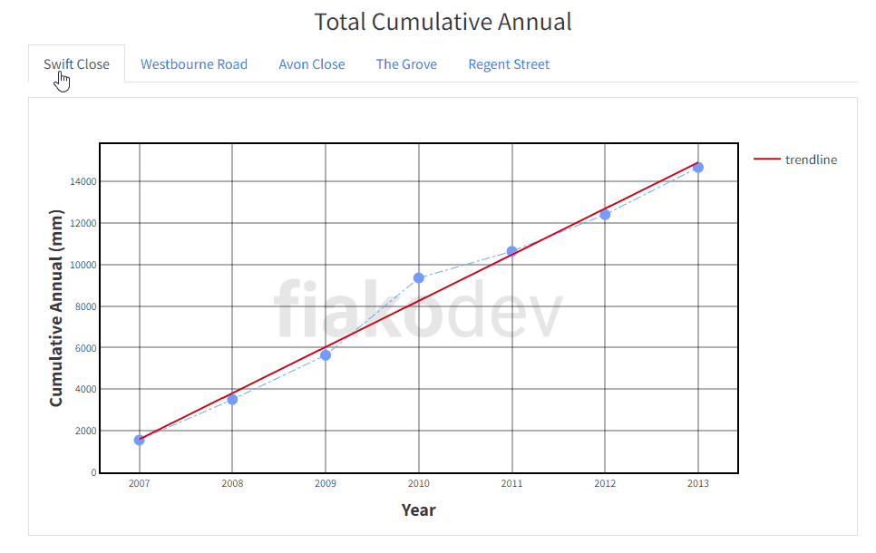
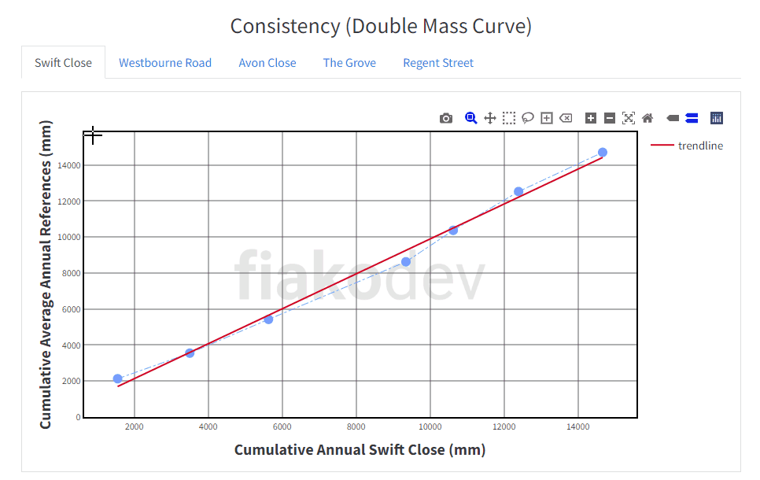

# RAINFALL DATA EXPLORER (hidrokit-rainfall)

<div align="center">
<br>


<br>

<br>

<a href="https://github.com/taruma/rainfall" target="_blank"><strong>Github Repository</strong></a> // <code>taruma/rainfall</code><br>
<a href="https://hidrokit-rainfall.herokuapp.com" target="_blank"><strong>Aplikasi</strong></a> // <code>hidrokit-rainfall.herokuapp.com</code><br>
<a href="https://youtu.be/IhjSoYlHW04" target="_blank"><strong>Presentasi & Demonstrasi</strong></a>
</div>

**Rainfall Data Explorer** atau `hidrokit-rainfall` adalah aplikasi web atau dashboard yang dapat digunakan untuk menganalisis data hujan harian. Dari aplikasi ini dapat memperoleh informasi hujan maksimum, total hujan, hari hujan, hari kering, dan kejadian hujan maksimum setiap periode yang ditentukannya dengan presentasi menggunakan visualisasi data. Grafik kumulatif tahunan dan konsistensi (kurva massa ganda) juga ditambahkan sejak versi v1.1.x. 

## FITUR APLIKASI

<div align="center">
<h3>Eksplorasi Data Hujan</h3>

<br>
<span align="center">Interaksi Tabel Data Hujan</span>
</div>

<div align="center">
<h3>Visualisasi Data Hujan</h3>

<br>
<span align="center">Visualisasi Data Hujan (line)</span>
<br><br>

<br>
<span align="center">Visualisasi Data Hujan (bar)</span>
</div>

<div align="center">
<h3>Analisis Data Hujan</h3>

<br>
<span align="center">Hasil Analisis (Tabel)</span>
<br><br>

<br>
<span align="center">Download Hasil Analisis (CSV)</span>
</div>

<div align="center">
<h3>Visualisasi Analisis Data Hujan</h3>

<br>
<span align="center">Visualisasi Analisis (Rekap)</span>
<br><br>

<br>
<span align="center">Visualisasi Max + Sum</span>
<br><br>

<br>
<span align="center">Visualisasi Dry + Rain</span>
<br><br>

<br>
<span align="center">Visualisasi Kejadian Hujan Maksimum</span>
<br><br>

<br>
<span align="center">Kumulatif Tahunan</span>
<br><br>

<br>
<span align="center">Konsistensi (Kurva Massa Ganda)</span>
</div>

## KEKURANGAN

Berikut daftar kekurangan atau _known issues_ aplikasi ini:

- Perlu dilakukan koreksi ataupun analisis lebih lanjut untuk masuk ke proses analisis frekuensi. Contohnya:
    - Koreksi kurva massa ganda.
    - Menghitung hujan wilayah.
- Harus melakukan pengolahan tabel setelah menerima hasil analisis dalam bentuk CSV. 

## LISENSI

[MIT LICENSE](./LICENSE)

```
Copyright ©️ 2022-2024 Taruma Sakti Megariansyah
Copyright ©️ 2022 PT. FIAKO ENJINIRING INDONESIA

Permission is hereby granted, free of charge, to any person obtaining a copy
of this software and associated documentation files (the "Software"), to deal
in the Software without restriction, including without limitation the rights
to use, copy, modify, merge, publish, distribute, sublicense, and/or sell
copies of the Software, and to permit persons to whom the Software is
furnished to do so, subject to the following conditions:

The above copyright notice and this permission notice shall be included in all
copies or substantial portions of the Software.

THE SOFTWARE IS PROVIDED "AS IS", WITHOUT WARRANTY OF ANY KIND, EXPRESS OR
IMPLIED, INCLUDING BUT NOT LIMITED TO THE WARRANTIES OF MERCHANTABILITY,
FITNESS FOR A PARTICULAR PURPOSE AND NONINFRINGEMENT. IN NO EVENT SHALL THE
AUTHORS OR COPYRIGHT HOLDERS BE LIABLE FOR ANY CLAIM, DAMAGES OR OTHER
LIABILITY, WHETHER IN AN ACTION OF CONTRACT, TORT OR OTHERWISE, ARISING FROM,
OUT OF OR IN CONNECTION WITH THE SOFTWARE OR THE USE OR OTHER DEALINGS IN THE
SOFTWARE.
```
